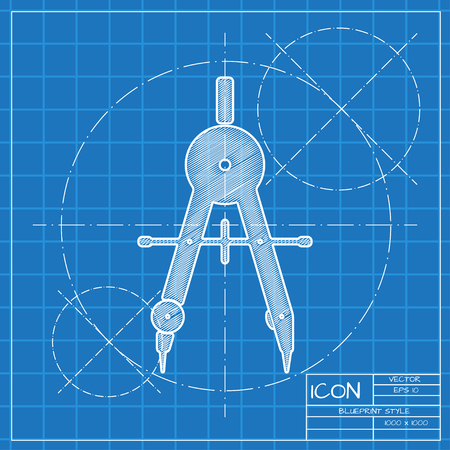

# Landing Protocol •   

An immutable protocol designed for **composability** and **auditability**.

WIP:

- Finish lender registry contract
- Get 100% test coverage for the Loan Coordinator contracts
- Make things more gas efficient

High Level Design goals and docs : [Here](https://hackmd.io/@williamx/ryis1TfI3)
